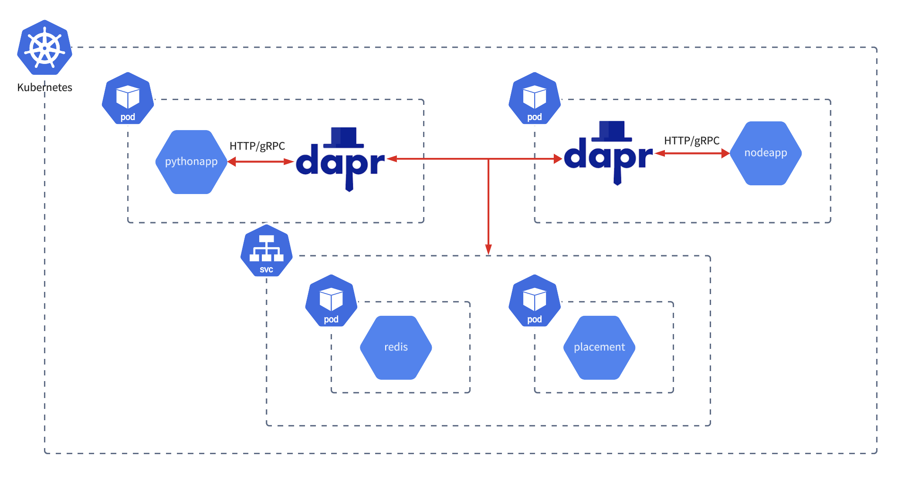

# dapr-sample-kubernetes
Connection test for pub/sub dapr application on kubernetes

# system configuration


# How to start
```zsh
# clone this repo
git clone git@github.com:shoe0088/dapr-sample-kubernetes.git

# set components path
cd dapr-sample-kubernetes
export COMPONENTS_PATH=$(realpath components)

# build docker image
docker build ./node -t nodeapp
docker build ./python -t pythonapp

# launch pods
cd manifest
kubectl apply -f redis.yml
kubectl apply -f placement.yml
kubectl apply -f nodeapp.yml
kubectl apply -f pythonapp.yml

# check pods status
kubectl get pods
```